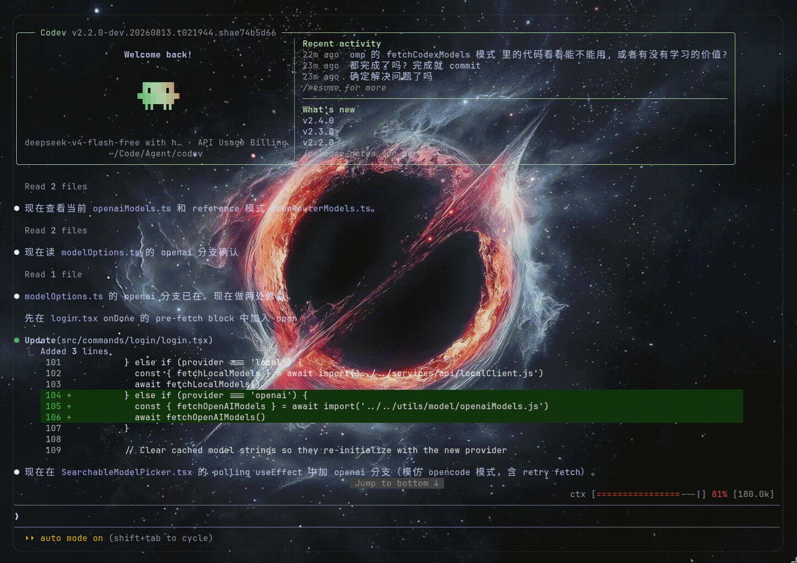

# Codev: Co-Dev with AI via Terminal


<div align="center">
  
</div>

## 📢 News

- **2026-08-26** ⚡ Speculative Tool Execution (spec-ptc) — Two-layer speculation engine inside `StreamingToolExecutor`: a `SpecStore`/`BudgetTracker` FIFO claim store that caches completed tool results and replays them on duplicate calls (`claim()` hit → zero re-execution), plus a streaming dispatcher that detects complete JSON inputs mid-token-stream via incremental brace-depth tracking and speculatively executes pure read-only tools before the model even finishes emitting `content_block_stop`. Bounded by max-inflight (5) / max-per-turn (20) budgets.
- **2026-08-26** 🖥️ REPL Tool — Real JavaScript REPL via Bun's `node:vm` sandbox, now default-on (`CODEV_REPL=0` to disable). The model writes batch code instead of issuing per-step tool calls: `await callTool("Glob", {...})` reaches primitive tools (Read/Write/Edit/Glob/Grep/Bash) with case-insensitive lookup, variables persist across calls (sync/async dual-path execution works around Bun VM quirks), a Proxy-based sandbox blocks `eval`/`require`/`process`, and `isTransparentWrapper` surfaces only the inner tool calls in the UI.
- **2026-08-26** 📊 `/benchmark` Display-First Radar TUI — `/benchmark` now defaults to a bordered two-column Braille radar chart view (chart left / metrics right); `/benchmark eval` actually runs the test suite. Reports reuse the click-to-expand mechanism.
- **2026-08-25** 🕸️ `/benchmark` Multi-Model Radar — Multi-model comparison radar with per-model stable coloring and deduplication, history run overlay, and `eval`/`clear`/`show` subcommands with headless support.
- **2026-08-18** 🎯 `/benchmark` — deepsearch benchmark command (OpenSeeker ReAct search loop + trajectory saving, ABSeeker step scoring, LongSeeker context management analysis). Run `{id, query, gt}` datasets headlessly or live in the TUI.
- **2026-08-10** 🧩 OpenAI First-Class Support — true direct Anthropic→OpenAI conversion via the shared `@ant/model-provider` package (thinking/reasoning supported everywhere); native `/login` flow for the ChatGPT subscription backend; dynamic model list loaded from real endpoints (`codex /models` + `api-key /models`).
- **2026-08-10** ⚙️ Full Headless `-p` Mode — complete non-SDK headless implementation with `text`/`json`/`stream-json` output and result-driven exit codes.
- **2026-07-27** 🦙 Llama.cpp Local Provider — native `/models` + `/props` endpoint based dynamic model discovery, context window parsed from the server `-c` value, auto-compact buffer scaled proportionally.
- **2026-07-08** 🖼️ Image Search & Render Hardening — WebSearchTool now exposes an explicit `search_images` flag that routes to SearXNG while Tavily handles general search; ImageShowTool downloads URLs to temp files and passes them to timg by path, fixes kitty protocol concurrency corruption (in-band sequences are now non-concurrent), and computes dimensions from terminal height with aspect-ratio-aware width.
- **2026-07-04** 🖼️ Inline Terminal Images — Native Kitty graphics protocol rendering via timg; WebSearch, WebFetch, and LocationTool results now display inline images directly in the TUI with cursor-safe hide/show and dynamic row layout.
- **2026-07-01** 🗺️ LocationTool unlimited search — Amap places search now paginates (1000/page, up to 10000 results); Google Places uses `next_page_token` (up to 60); photo limits removed.
- **2026-06-22** 🔊 Groq Whisper STT — CLI `/voice` now uses Groq Whisper API (cloud whisper-large-v3, no Python needed) and `node-edge-tts` for TTS, matching Friend's stack.
- **2026-06-21** 🎙️ Groq Free STT — Friend voice input now supports Groq Whisper API as STT provider; TypeScript-only, no Python subprocess required.
- **2026-06-21** 🖥️ Friend Desktop — `/friend start` launches a Tauri desktop VRM companion app with full-screen mode, real-time TTS/STT, and inter-process communication.
- **2026-06-21** 🎤 Microphone Fix — Resolved Microphone access denied in WebKitGTK; switched to arecord/parecord subprocess audio capture.
- **2026-06-20** 🤖 /friend Command — In-process VRM companion service: SSE broadcast, voice capture (push-to-talk + streaming), Edge TTS / Qwen TTS, and persona generation from VRM screenshot.
- **2026-06-19** 📋 /release-notes — New command to display version release notes and what's new.
- **2026-06-15** 🎯 Goal Tracking — New `/goal` command with prompt input footsider and lastline display for real-time goal tracking.
- **2026-06-15** 🖼️ WebSearch Image Preview — WebSearch markdown now displays inline image links natively.
- **2026-06-15** 🔊 Feishu Voice — Feishu integration now supports both VoxCPM and Edge-TTS voice synthesis.
- **2026-06-15** 📝 Feishu Markdown — Feishu bot messages render with full markdown styling.
- **2026-06-15** 🤖 Feishu Connect — New Feishu (飞书) bot integration with message relay and voice TTS.
- **2026-06-14** 📱 Desktop Provider Sync — Desktop now syncs provider config from TUI; model list uses sidecar proxy to avoid CORS.
- **2026-06-14** 🛡️ NVIDIA Sidecar Fix — Use sidecar for NVIDIA, direct fetch for OpenRouter/OpenCode.
- **2026-06-13** 🗣️ Voice CN/TW — Added Chinese (zh-CN) and Taiwanese (zh-TW) voice support for TTS.
- **2026-06-02** 🤝 Agent Team — Multi-agent collaboration via Tmux backend with teammate layout manager, dynamic team scaling, and spawn utilities for coordinated task execution.
- **2026-06-01** 🧩 SubAgent Swarm Topology — Dedicated Explore 🔍, Plan 📋, and Verification 🧪 subagents for autonomous multi-step task decomposition and execution.
- **2026-05-25** 🤖 AI Friend on Desktop — Companion mode with `real-time audio/video`, avatar & background image upload, edge glow effect on transcript, and localStorage persistence.
- **2026-05-25** 🖥️ Desktop app launched — Tauri-based native UI with sidebar, tabs, title bar, and session management. Subagent inherits parent class config. Branding updated to Versper AI.
- **2026-05-23** 🧘 Added OpenCode Zen Provider — a new model provider for calm, focused AI interactions.
- **2026-05-22** 🔧 Fixed OpenCode login flow and refined prompt identity for clearer agent behavior.
- **2026-05-08** 🐛 Fixed model list not refreshing after `/login` opencode freemodel exit; subagent creation now works without API key in free mode.
- **2026-05-06** 🚀 Added OpenCode as a free provider — includes GPT-5 Nano and Big Pickle 🥒 models, `/model` list with life-free model display, and auto-refresh. Introduced ctx_line context tracking with online persistence. Better collapsing fetch results and auto-compact documentation polish. Merged PR #6 for Tavily search backend migration.
- **2026-04-30** 🔍 Added Tavily as optional search backend in WebSearchTool via PR #6.
- **2026-04-24** 🧹 Cleaned up empty contributor docs.
- **2026-04-21** 🛡️ Fixed auto-compact env in settings.json; Codev now handles Ctrl+C resume gracefully.
- **2026-04-20** 📝 Documented ToolSearch behavior and <tr> table formatting.
- **2026-04-19** 📖 Described auto-dream and subagent features in README; punctuation and layout polish. Tagged **v2.0.1** 🏷️.
- **2026-04-18** 💭 Snapshot auto-dream feature; ToolSearch now uses WebSearch under the hood.
- **2026-04-15** 🌙 Auto Dream — AI autonomously reflects and builds internal memory. Fixed chatId overflow by migrating from Number to String.
- **2026-04-13** 🧠 All tools allowed in auto mode without classifier; auto-compact triggers on context size exceeded; ToolSearch enabled by default for all providers; OpenRouter full model loading. Tagged **v2.0.0** 🏷️.
- **2026-04-12** ⚡ Live refresh typing status; WebFetch now supports shouldDefer for lazy loading; symbol links documented as usable everywhere.
- **2026-04-09** 🎨 Major README overhaul — VersperAI branding with Banner & Logo, tabular layout, websearch/webfetch documentation, TypeScript main branch vs Python legacy explained. Tagged **v2.0.0** 🏷️.
- **2026-04-08** 🌐 Full WebSearch toolchain — SearXNG integration, Jina AI websearch & fetch, WebFetch UI notes, build fix. Four search approaches landed in one day.
- **2026-04-07** 🔍 Zero-search prototype; Python env removed; TLS-enabled web search working end-to-end.
- **2026-04-06** 🛠️ Open ripgrep via USE_BUILTIN_RIPGREP=0; WebFetch UI notes; skill message renamed; WebSearch API error fixed.
- **2026-04-05** 🤖 AutoMode — autonomous decision-making execution mode. `/sandbox` with sandbox-runtime @0.0.44. Project renamed to codev. OpenRouter ↔ Local model switching, auto-refresh TUI, Telegram `/login` local model transition.
- **2026-04-04** 📱 Telegram backend — `/telegram` command, interactive commands, message receiving in TUI, chatId overflow fixed. `/buddy` companion mode; recent activity in individual directories.
- **2026-04-03** 🔄 Reborn as verspercode **v0.1.0** — complete `/login` system (OpenRouter + local models), `/model` search & UI, free OpenRouter model auto-load, onboarding flow. Local model filesystem-based provider.

<details>
<summary>Earlier news</summary>

- **2026-04-01** 🧹 Removed autoresearch, evolve modules, and Cursor scripts — streamlining toward v2. Tagged **v1.0.0** 🏷️.
- **2026-03-31** 🖥️ CLI update for better terminal interaction.
- **2026-03-30** 🐛 Fixed error type-in when using `/resume` session.
- **2026-03-29** 🧠 Memory routing — route-runtime-long_term for persistent context. CLI shell split to <10K lines. Browser vision click/control fixes. Paper GIF in README; --paper API call optimization.
- **2026-03-28** 📄 Academic paper pipeline — `/evolve` autonomous evolution, `/compact` context compression, LaTeX paper template, main.pdf compilation. Chrome-based research v1.0.
- **2026-03-27** 🔬 Research workflow — `/paper` and `/code` commands, 4-step research + autoresearch, ANN vector index, hybrid retrieval with semantic cache, external memory, token-budgeted evidence pipeline, IncompleteRead retry, long-term index cache. Workflows engine, `/resume` session toggle, CLI UI refresh.
- **2026-03-26** 🏗️ Configuration overhaul — YAML → JSON + .env + TOML. Clean config dir.
- **2026-03-24** 🌐 Browser control — Chrome DevTools MCP integration, WeChat gateway, Telegram gateway. Setup wizard, README with demo GIF, version menu.
- **2026-03-22** 🎉 Initial commit — codev **v0.1.0** born.

</details>

## 📦 Install

```bash
# script install
curl -fsSL https://raw.githubusercontent.com/chenbhao/Codev/main/install.sh | bash

# source install
git clone https://github.com/chenbhao/Codev.git && cd Codev && bun install && bun run build && codev

# if want global use bin file
# cp dist/codev ~/.local/bin
ln -sf dist/codev ~/.local/bin/codev

# then can use Codev in everywhere after `/login`

# from https://models.dev/api.json get model detail
```

## 🚀 Quick Start

> [!IMPORTANT]
> If you no need `auto-compact / dream / control context-window`
> and `websearch` feature. you can no configuration anything
>
> if you no need free `local-websearch` you can skip config `searxng``
> and just set`TAVILY_API_KEY` in env

```bash
# or local llm via llama.cpp
# /login -> Llama.cpp -> http://127.0.0.1:8001 (default)
# provider: local, models fetched from /models + /props endpoints
```

```bash
# also you need set baseUrl for local provider
# config in ~/.claude.json
"localBaseUrl": "http://127.0.0.1:8001",
"localModelName": "default"
```

```bash
# Maximum_Context_Window = min(CLAUDE_CODE_MAX_CONTEXT_TOKENS, CLAUDE_CODE_AUTO_COMPACT_WINDOW) - 20000
# set 200k env in ~/.claude/settings.json or terminal
# the 20k is used to compact as buffer band
# set tool_search env
# set agentteam in tmux
{
  "env": {
    "USER_TYPE": "ant",
    "CLAUDE_CODE_MAX_CONTEXT_TOKENS": "200000",
    "CLAUDE_CODE_AUTO_COMPACT_WINDOW": "200000",
    "ENABLE_TOOL_SEARCH": "true",
    "TAVILY_API_KEY": "",
    # "CLAUDE_CODE_EXPERIMENTAL_AGENT_TEAMS": "0", default 1 
    "teammateMode": "tmux", # or in-process
    "groqApiKey": "gsk_" # https://console.groq.com
    # map locationtool
    "AMAP_API_KEY": "b_",
    "GOOGLE_MAPS_API_KEY": "AI_"
  }

  # set auto-dream config
  "autoMemoryEnabled": true,
  "autoDreamEnabled": true,

  # stt-tts support zh-CN
  # TW girl voice
  "voiceLanguage": "zh-TW",
  "voiceTTSVoice": "zh-TW-HsiaoChenNeural"

  # CN girl voice
  "voiceLanguage": "zh-CN",
  "voiceTTSVoice": "zh-CN-XiaoxiaoNeural"
  # or "voiceTTSVoice": "zh-CN-XiaoyiNeural",
}
```

```bash
# Config SearXNG
# 1. docker configuration
# local config search engine - searxng in archlinux
# make sure have install docker and docker-compose
sudo pacman -S docker-compose && docker
docker --version && docker compose version
sudo usermod -aG docker $USER

# make sure open pc and now start docker daemon
sudo systemctl enable --now docker

# 2. docker-compose pull
# use VersperSearch a pre-build docker config in https://github.com/chenbhao/VersperSearch
# or install searxng in docker-compose by yourself
curl -fsSL \
-O https://raw.githubusercontent.com/searxng/searxng/master/container/docker-compose.yml \
-O https://raw.githubusercontent.com/searxng/searxng/master/container/.env.example

# add json source in formats behind html - jsonl in 87 lines
cd searxng/core-config/ && sudo nvim settings.yml

# start searxng engine
docker compose up -d

# 3. check search feature
# check in every browser
firefox http://localhost:8080
```

```bash
# test
HTTP_PROXY=http://127.0.0.1:8888 HTTPS_PROXY=http://127.0.0.1:8888 <commands>
mitmproxy -p 8888
```

```bash
# /voice
"voiceTTSVoice": "zh-TW-HsiaoChenNeural",
"voiceLanguage": "zh-TW",

# /imageshow
sudo pacman -S timg

# node-edge-tts
# local whisper-stt
uv venv
uv pip install faster-whisper edge-tts voxcpm

hf download Systran/faster-whisper-base \
  --local-dir ~/.cache/huggingface/hub/models--Systran--faster-whisper-base
```

## ✨ Features

### ImageShow On Terminal

<table align="center">
  <tr>
    <td></td>
  </tr>
</table>

### Agent Team and View via Tmux

<table align="center">
  <tr>
    <td></td>
  </tr>
</table>

### Auto Compact & Dream & SubAgent

#### 🧠 Core Mechanisms of Cycle Long Run

- Auto Compact — Automatically optimizes and compresses historical context to bypass sequence length bottlenecks.
- Dream — Asynchronously distills operational data into long-term insights.

#### 🗂️ SubAgent Swarm Topology

| SubAgent Type | Core Responsibility |
| :--- | :--- |
| 🛡️ **General-Purpose** | Orchestrates routing, high-level user interaction, and dispatching. |
| 🔍 **Explore** | Conducts deep semantic search and autonomous tool discovery. |
| 📋 **Plan** | Handles multi-step chain-of-thought strategy and task decomposition. |
| 🧪 **Verification** | Executes automated runtime validation, assertion checks, and fault tolerance. |

<table align="center">
  <tr>
    <td></td>
  </tr>
</table>

### WebSearch & WebFetch Tools

<table align="center">
  <tr>
    <td></td>
    <td></td>
    <td></td>
  </tr>
</table>
