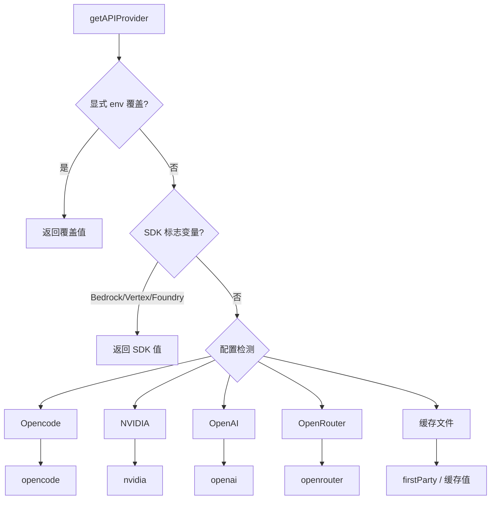
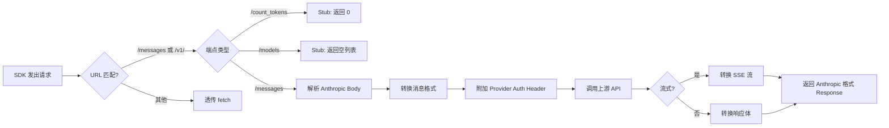
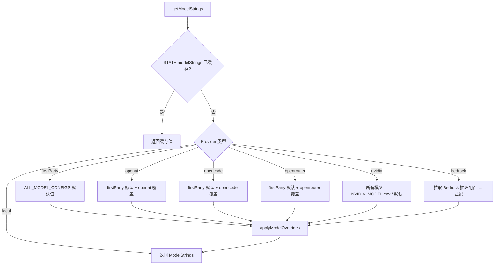
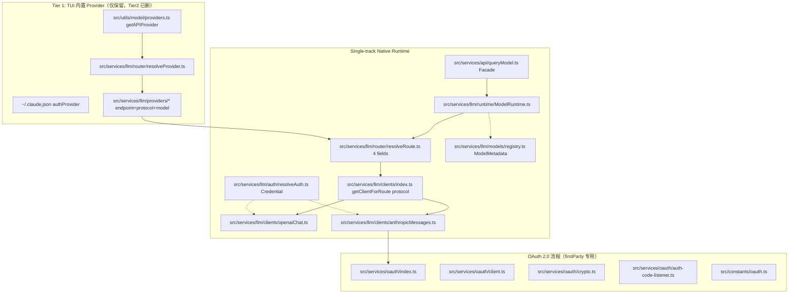
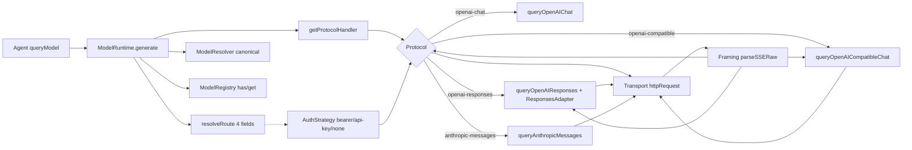

# 多 Provider 认证与协议转换架构

> 本文档描述 Codev 的多 Provider 认证架构、OAuth 2.0 流程、API 协议转换机制以及 Provider 配置管理体系（仅保留 Tier1 TUI）。
> 代码库：`/home/yuki/Code/Agent/Codev`

---

## 1. 支持的认证提供者

Codev 支持以下 Provider，按认证方式与协议类型分类：

| Provider | 认证方式 | 协议格式 | 实现位置 |
|---|---|---|---|
| **Anthropic (first-party)** | OAuth 2.0 + PKCE 或 API Key | Anthropic Messages | `src/services/oauth/`, `src/services/api/client.ts` |
| **Anthropic Bedrock** | AWS STS / IAM 凭证 | Anthropic Messages (SDK) | `src/services/api/client.ts` (条件导入) |
| **Anthropic Vertex AI** | GCP google-auth-library | Anthropic Messages (SDK) | `src/services/api/client.ts` (条件导入) |
| **Anthropic Foundry (Azure)** | API Key 或 Azure AD | Anthropic Messages (SDK) | `src/services/api/client.ts` (条件导入) |
| **OpenAI / Codex** | API Key 或 Codex OAuth | `openai_chat` 或 `openai_responses` | `src/server/services/openaiOfficialProvider.ts` |
| **OpenRouter** | API Key | `openai_responses` (Proxy) | `src/utils/model/providers.ts` |
| **OpenCode Zen** | API Key 或免费 (public) | `openai_chat` (Fetch Override) | `src/services/api/opencodeClient.ts` |
| **NVIDIA NIM** | API Key (build.nvidia.com) | `openai_chat` (Fetch Override) | `src/services/api/nvidiaClient.ts` |
| **Local (Ollama/LM Studio/vLLM)** | 无 (Dummy Key) | `anthropic` 或 `openai_chat` | `src/utils/model/providers.ts`（Tier1） |
| **Llama.cpp** | 无 | `anthropic` (Fetch Override) | `src/services/api/localClient.ts` |
| **DeepSeek, Zhipu GLM, Kimi, MiniMax, 接口AI, 胜算云** | API Key (auth_token) | `anthropic` (Native) | `src/utils/model/providers.ts`（Tier1） |

---

## 2. 认证架构模式

### 2.1 架构总览 — 仅保留 Tier1 TUI

Codev 仅保留 Tier1 TUI 内置 Provider（原始 Claude Code），Tier2 预设系统已移除：

```
Tier 1: TUI 内置 Provider (原始 Claude Code)
  用途: 终端 /login 快速切换
  存储: ~/.claude.json (单字段 authProvider)
  实现: src/services/api/client.ts + src/utils/model/providers.ts
```

### 2.2 API Provider 类型定义

Provider 类型定义在 `src/utils/model/providers.ts`：

```typescript
export type APIProvider =
  | 'firstParty'
  | 'openrouter'
  | 'openai'
  | 'local'
  | 'opencode'
  | 'nvidia'
  | 'bedrock'
  | 'vertex'
  | 'foundry'
```

Provider 检测优先级：
1. **显式环境变量覆盖** (`CLAUDE_CODE_API_PROVIDER` 或 `BETTER_CLAWD_API_PROVIDER`)
2. **SDK 标志变量** (`CLAUDE_CODE_USE_BEDROCK`, `CLAUDE_CODE_USE_VERTEX`, `CLAUDE_CODE_USE_FOUNDRY`)
3. **配置检测** (`isOpencodeConfigured()`, `isNvidiaConfigured()`, `isOpenAIConfigured()`, `isOpenRouterConfigured()`)
4. **文件缓存** (`~/.claude.json` 中的 `authProvider` 字段)



### 2.3 Anthropic OAuth 2.0 with PKCE

Anthropic first-party 认证使用标准的 OAuth 2.0 Authorization Code Flow + PKCE，完整流程：

```
┌─────────┐     ┌──────────────┐     ┌───────────────┐     ┌────────────┐
│  CLI    │     │ localhost    │     │ Anthropic     │     │ Browser   │
│         │     │ OAuth Server │     │ OAuth Provider│     │ (User)    │
└────┬────┘     └──────┬───────┘     └───────┬───────┘     └─────┬──────┘
     │ 1. start()      │                      │                  │
     │────────────────>│                      │                  │
     │ 2. port          │                      │                  │
     │<────────────────│                      │                  │
     │                 │                      │                  │
     │ 3. generateCodeVerifier(), challenge() │                  │
     │ 4. buildAuthUrl()                      │                  │
     │                 │                      │                  │
     │ 5. openBrowser(automaticUrl)           │                  │
     │───────────────────────────────────────────────────────────>
     │                 │                      │                  │
     │                 │  6. HTTP GET /callback?code=...&state=  │
     │                 │<─────────────────────────────────────── │
     │                 │                      │                  │
     │ 7. validate state, extract code        │                  │
     │ 8. exchangeCodeForTokens(code)         │                  │
     │───────────────────────────────────────>│                  │
     │                 │    9. access_token + refresh_token     │
     │<───────────────────────────────────────│                  │
     │                 │                      │                  │
     │10. store tokens, set API key to null   │                  │
     │11. fetchProfileInfo() - 获取订阅类型    │                  │
```

**核心文件：**

| 职责 | 文件 |
|---|---|
| OAuth 服务入口 | `src/services/oauth/index.ts` - `OAuthService` 类 |
| PKCE 加密工具 | `src/services/oauth/crypto.ts` - SHA-256 code challenge |
| 授权码监听 | `src/services/oauth/auth-code-listener.ts` - 本地 HTTP 服务器 |
| Token 交换与刷新 | `src/services/oauth/client.ts` - axios POST 到 token endpoint |
| Profile 获取 | `src/services/oauth/getOauthProfile.ts` |
| OAuth 类型定义 | `src/services/oauth/types.ts` |
| OAuth 端点配置 | `src/constants/oauth.ts` - prod/staging/local 三级 |

**OAuth 端点配置** (`src/constants/oauth.ts`) 支持三层环境：

- **Production**: `api.anthropic.com`, `platform.claude.com`
- **Staging**: `api-staging.anthropic.com`, `platform.staging.ant.dev` (仅 ant 内部)
- **Local**: 可配置的 localhost 端口 (用于本地开发)
- **Custom (FedStart)**: 受限的白名单 Base URL 覆盖

---

## 3. Protocol Translation — 单轨 Native 直连为主，Fetch Override 仅 Legacy

### 3.1 核心问题

Claude Code 使用的 `@anthropic-ai/sdk` 只认识 Anthropic Messages API 格式。对于使用 OpenAI 协议的非 Anthropic Provider，必须进行协议转换。

```
Anthropic Messages API  ←→  OpenAI Chat Completions / Responses API
──────────────────────       ─────────────────────────────────────
POST /v1/messages            POST /v1/chat/completions
POST /v1/messages?stream     POST /v1/chat/completions?stream=true
GET /v1/models               GET /v1/models
POST /v1/count_tokens        (无对应端点，需要 Stub)
```

### 3.2 单轨 Native 直连（P6 最终形态）

**主路径**：`Agent → src/services/api/queryModel.ts:17 queryModel() → src/services/llm/runtime/ModelRuntime.ts:10 generate() → src/services/llm/router/resolveRoute.ts:11 resolveRoute() → LLMRoute → src/services/llm/clients/index.ts:21 getClientForRoute(protocol) → {openaiChat|anthropicMessages}`，不经 `Anthropic SDK`，直接 `fetch` 上游 Chat Completions。形态学习自 `opencode/packages/llm/src/route/client.ts:compile()` 的 `LLMRequest→Route(Protocol+Endpoint+Auth)→LLMClient.stream`，`codev` 侧简化为 `convertAnthropicMessagesToOpenAI → buildOpenAIRequestBody → adaptOpenAIStreamToAnthropic`。

```typescript
// src/services/api/queryModel.ts:17 — 稳定 Facade，薄封装 ModelRuntime
export async function* queryModel(messages, systemPrompt, thinkingConfig, tools, signal, options) {
  const { modelRuntime } = await import('../llm/runtime/index.js')
  yield* modelRuntime.generate({ model: options.model, messages, systemPrompt, tools, signal, options, thinkingConfig })
}
// src/services/llm/runtime/ModelRuntime.ts:10 — resolveRoute(4字段) + getClientForRoute(protocol) + auth分离
// src/services/llm/clients/openaiChat.ts:52 — openai-chat 共享客户端（无 Provider 分支）
```

* **Fetch Override 仅 legacy**：`nvidia` 仍 `src/services/api/nvidiaClient.ts:createNvidiaFetchOverride()` 注入 `getAnthropicClient()`（`src/services/llm/clients/anthropicMessages.ts:1` 标注 `legacy→native HTTP` 待迁移）；`opencode` 的 `fetch-override fallback` 已在 `5f944f0` 删除，原生直连已验证 ok；`opencodeClient.ts` 仅保留 `getCachedOpencodeModels()` 等元数据查询供 `openaiChat.ts:104` 判定 `isFree`。

### 3.3 协议转换通用模式（Native 与 Fetch Override 复用同一转换管线）

所有路径共享相同的消息/工具转换（`@ant/model-provider`），差异仅在 Transport（Native `fetch` 直连 vs SDK `fetch` 钩子）：



### 3.4 消息格式转换

核心转换函数族位于共享包 `packages/@ant/model-provider`（进程内 provider 桥接层，`opencodeClient`/`nvidiaClient`/`openaiClient` 共用）：

```
Anthropic → OpenAI:
  convertAnthropicMessagesToOpenAI(messages, systemPrompt)
  - system → role: 'system' 消息
  - image block → image_url (data: URI)
  - tool_result → role: 'tool' 消息
  - tool_use → tool_calls 数组
  - thinking → reasoning_content (提供商扩展)

  convertAnthropicToolsToOpenAI(tools)
  - { name, description, input_schema } → { type: 'function', function: { ... } }

OpenAI → Anthropic (流式):
  convertOpenAIStreamToAnthropic(openaiStream, model)
  - SSE data: {"choices":[{ "delta":{ "content":"..." } }]}
    → event: content_block_delta\ndata: {"delta":{"type":"text_delta","text":"..."}}

OpenAI → Anthropic (非流式):
  - choices[0].message.content → content: [{ type: 'text', text: ... }]
  - tool_calls → tool_use content blocks
  - finish_reason 'stop' → 'end_turn'
  - finish_reason 'tool_calls' → 'tool_use'
```

**Streaming SSE 事件对照表：**

| Anthropic (输出) | OpenAI (输入) |
|---|---|
| `message_start` | 合成，包含 message ID |
| `content_block_start` | 首次 `delta.content` 或 `delta.tool_calls.id` |
| `content_block_delta` text_delta | `delta.content` |
| `content_block_delta` thinking_delta | `delta.reasoning_content` |
| `content_block_start` tool_use | `delta.tool_calls[].id` |
| `content_block_delta` tool_use_delta | `delta.tool_calls[].function.arguments` |
| `content_block_stop` | delta 结束 / tool_call 完成 |
| `message_delta` | `choices[0].finish_reason` |
| `message_stop` | `[DONE]` |

### 3.5 服务端 Proxy 模式

除了客户端的 Fetch Override 模式，Codev 还实现了一套**服务端 Proxy**，位于 `src/server/proxy/handler.ts`。

设计目标：将协议转换逻辑从客户端分离到独立 HTTP 服务，支持更灵活的 Provider 管理。

```
CLI/SDK                                    Proxy Server                             Upstream
   │                                           │                                       │
   │  POST /proxy/v1/messages                  │                                       │
   │  (Anthropic 格式请求)                     │                                       │
   │ ───────────────────────────────────────>  │                                       │
   │                                           │  获取 Provider 配置                    │
   │                                           │  读取 baseUrl, apiKey, apiFormat      │
   │                                           │                                       │
   │                                           │  anthropicToOpenaiChat(body)          │
   │                                           │  ─ 或 ─                              │
   │                                           │  anthropicToOpenaiResponses(body)     │
   │                                           │                                       │
   │                                           │  POST /v1/chat/completions            │
   │                                           │  或 POST /v1/responses                │
   │                                           │ ──────────────────────────────────>  │
   │                                           │                                       │
   │                                           │  openaiChatToAnthropic(res)           │
   │                                           │  或 openaiResponsesToAnthropic(res)   │
   │                                           │  (流式: XxxStreamToAnthropic)         │
   │                                           │                                       │
   │  ← Anthropic 格式响应                     │                                       │
   │ <───────────────────────────────────────  │                                       │
```

**服务端 Proxy 转换文件结构：**

```
src/server/proxy/
├── handler.ts                         # 主入口: POST 分发 + 错误处理
├── transform/
│   ├── types.ts                       # Anthropic & OpenAI 类型定义
│   ├── anthropicToOpenaiChat.ts       # 请求转换: Messages → Chat Completions
│   ├── anthropicToOpenaiResponses.ts  # 请求转换: Messages → Responses API
│   ├── openaiChatToAnthropic.ts       # 响应转换: Chat Completions → Messages
│   ├── openaiResponsesToAnthropic.ts  # 响应转换: Responses API → Messages
│   └── toolArguments.ts               # Tool 参数格式修正工具
└── streaming/
    ├── openaiChatStreamToAnthropic.ts         # 流式转换: Chat Completions SSE
    ├── openaiResponsesStreamToAnthropic.ts    # 流式转换: Responses API SSE
    └── openaiResponsesStreamToAnthropicResponse.ts
```

### 3.6 DeepSeek 推理兼容性

Proxy 还处理 DeepSeek 的特殊格式：

```typescript
function shouldUseDeepSeekReasoningCompat(baseUrl: string): boolean {
  return /(^|[./-])deepseek([./-]|$)/i.test(baseUrl) ||
         /(^|[./-])opencode\.ai([:/]|$)/i.test(baseUrl)
}
```

启用后，**thinking blocks** 会通过 `reasoning_content` 字段回传，并且 Anthropic 的 `thinking.type` 会被转换为 DeepSeek 兼容格式。

---

## 4. 各 Provider 集成详解

### 4.1 NVIDIA NIM

**文件**: `src/services/api/nvidiaClient.ts`（legacy fetch-override，待迁 `src/services/llm/clients/anthropicMessages.ts:1 native HTTP`）

- **认证**: `getNvidiaApiKey()` → `Authorization: Bearer <key>`（经 `src/services/llm/auth/resolveAuth.ts:18 resolveAuth('nvidia')` 统一）
- **特殊头**: `HTTP-Referer: https://claude.ai/`, `X-BILLING-INVOKE-ORIGIN: Better-Clawd`
- **端点**: `{baseUrl}/v1/chat/completions` (默认 `https://integrate.api.nvidia.com/v1`)
- **Model 列表**: 从 `/v1/models` 动态拉取，缓存于 `cachedNvidiaModels` 模块变量
- **默认 Model**: `nvidia/llama-3.1-nemotron-70b-instruct` (可通过 `NVIDIA_MODEL` 环境变量覆盖)
- **网络架构**: 当前仍经 Sidecar 代理转发（`/api/proxy/nvidia`），Client=Protocol 收敛后将与 `openai-chat` 一致直连 `fetch`。

### 4.2 OpenCode Zen

**文件**: `src/services/llm/providers/opencode.ts` + `src/services/llm/clients/openaiChat.ts:52`（单轨 Native；`src/services/api/opencodeClient.ts` 仅保留元数据查询）

**单轨 Native 路径** (`ff00aaf/b4ed8e9/54d775c` 后) — 学习自 `opencode/packages/llm/src/route/client.ts:compile()` 的 `LLMRequest→Route(Protocol+Endpoint+Auth)→LLMClient.stream`：
- **分流**: `src/services/api/queryModel.ts:17 → src/services/llm/runtime/ModelRuntime.ts:10 → resolveRoute('opencode') → getClientForRoute('openai-chat') → queryOpenAIChat`，不经 `Anthropic SDK`，与 `openai/deepseek` 共用同一 `Client`（Client=Protocol，无 Provider 分支）
- **协议**: 直接 `POST https://opencode.ai/zen/v1/chat/completions` (OpenAI Chat Completions)，`LLMRequest{model,system,messages,tools}` 经 `convertAnthropicMessagesToOpenAI/Tools` 显式转换 → `buildOpenAIRequestBody`，流式经 `adaptOpenAIStreamToAnthropic` 回 `Anthropic` 事件
- **认证**: `src/services/llm/auth/resolveAuth.ts:11 resolveAuth('opencode')` → `Bearer <key>` 或 `Bearer public`，`openaiChat.ts:125` 无有效 key 时注入 `x-anthropic-billing-header` 暗桩（与旧 `opencodeClient` 一致），`x-opencode-*` 头透传
- **免费模型健壮性** (`src/services/llm/clients/openaiChat.ts:101`): `model.includes('free'/'contributor')` 或 `getCachedOpencodeModels().isFree` 判定（请求体不裁剪，全量发送）；瞬态 `500` 自动 `fallback to big-pickle` 重试（`f141d7c`），确保 `hi` 在无 shim 下可用；`5f944f0` 已移除 `fetch-override fallback`，原生直连验证 ok
- **优势**: 规避 `fetch-override` 的 `x-anthropic-billing-header` 版本漂移与 `effort/beta` 透传导致的 `500`，`muse-spark` 等非 Claude 模型可直接 `tool_choice:auto`

**遗留兼容** (`src/services/api/opencodeClient.ts`):
- 保留 `getCachedOpencodeModels()` / `getOpenCodeApiKey()` 等元数据查询供 `openaiChat.ts` 判定 `isFree`；`createOpenCodeFetchOverride()` 的 `fetch-override` 路径已删除
- Model 发现仍从 `https://models.dev/api.json` + `https://api.github.com/repos/anomalyco/opencode/releases/latest` 动态拉取，缓存于 `cachedModels`

### 4.3 OpenAI / Codex Official

**文件**: `src/server/services/openaiOfficialProvider.ts`

- **认证**: Codex OAuth (通过 `hahaOpenAIOAuthService`)
- **协议**: `openai_responses` (Responses API)
- **运行时种类**: `openai_oauth` (需要 Token 刷新)
- **Base URL**: `/backend-api/codex` (从 `OPENAI_CODEX_API_ENDPOINT` 派生)
- **Model 列表**: 来自 `src/services/openaiAuth/models.ts` 的 `OPENAI_CODEX_MODEL_CATALOG`

### 4.4 OpenAI 兼容直连 (openai provider)

**目录**: `src/services/api/openai/`（转换管线来自 `@ant/model-provider`）

- **认证**: `OPENAI_API_KEY` → `Bearer <key>`（本地端点可缺省）; `OPENAI_BASE_URL` 指定端点
- **协议**: `openai_chat` (Chat Completions) — 经 fetch override 拦截 Anthropic `/messages` 转换
- **Model**: `resolveOpenAIModel()`（`OPENAI_MODEL` > `OPENAI_DEFAULT_*_MODEL` > 默认映射 > 透传）
- **Thinking**: `OPENAI_ENABLE_THINKING` 或模型名含 `deepseek`/`mimo` 自动开启；
  请求体同时发送 `thinking`/`enable_thinking`/`chat_template_kwargs` 三套格式，
  `reasoning_content` 思维流映射为 Anthropic thinking 块（含空字符串往返）
- **Model 拉取**: telegram `/connect` 用 `fetchOpenAICompatibleModelIds()` 从 `/v1/models` 获取
- **适用场景**: OpenAI 官方、DeepSeek、vLLM、Ollama 等任何 OpenAI Chat Completions 端点

### 4.5 GitHub Copilot (模型列表)

**文件**: `src/services/api/copilotClient.ts`（仅保留模型发现，chat 链已清理）

- **认证**: OAuth Token (通过 `connectedProviders['github-copilot']`)
- **Model 发现**: 双源策略 — 优先从 Copilot API 获取，fallback 到 `models.dev/api.json`
- **用途**: telegram `/connect` 流程预览可用模型

### 4.6 Llama.cpp (Local)

**文件**: `src/services/api/localClient.ts`

- **认证**: 无 (无需 API Key)
- **协议**: `anthropic` (Fetch Override, 复用 `client.ts` 的直连路径)
- **端点**: 默认 `http://127.0.0.1:8001`，通过 `~/.claude.json` 的 `localBaseUrl` 配置
- **Model 发现**: 从 Llama.cpp 原生端点获取：
  - `GET {baseUrl}/models` → `data[].id` + `meta.n_ctx` + `meta.n_ctx_train` + `status.args`
  - `GET {baseUrl}/props` → `default_generation_settings.n_ctx`（`-c` 参数值）
- **上下文窗口解析优先级**: `serverCw`（`/props` n_ctx）→ per-model `meta.n_ctx` → `--ctx-size` from `status.args` → `meta.n_ctx_train` → 8192 fallback
- **后台拉取**: 启动时自动调用 `fetchLocalModels()`，每隔 2 秒轮询缓存直到加载完成
- **缓存**: 模块级 `cachedModels` 变量，不持久化到磁盘
- **Model Picker**: `getModelOptionsBase()` 中 `local` provider 优先级高于 `USER_TYPE === 'ant'` 检查

---

## 5. Provider 预设系统（已移除 Tier2）

> **Tier2 Provider 预设系统已移除**，仅保留 Tier1 TUI 内置 Provider。相关 Tier2 配置与代理文件已删除。

---

## 6. Model 管理与切换

### 6.1 Model 解析链

```
src/utils/model/
├── providers.ts      → getAPIProvider() - 确定当前 Provider
├── modelStrings.ts   → getModelStrings() - 解析 Provider 对应的 Model ID
├── model.ts          → getMainLoopModel() - 最终选择的 Model
└── configs.ts        → ALL_MODEL_CONFIGS - 每个 Model 在各 Provider 的映射
```

**Model 字符串解析流程：**



### 6.2 Provider 切换时的缓存清除

**重要**：切换 Provider 后必须调用 `clearModelStrings()`，否则旧的 Model ID 会持续生效：

```typescript
// src/utils/model/modelStrings.ts
export function clearModelStrings(): void {
  setModelStringsState(null as unknown as ModelStrings)
}
```

### 6.3 Model Context Windows

Tier1 下模型上下文窗口由 `src/utils/model/` 中的 `ALL_MODEL_CONFIGS` 及环境变量决定。

---

## 7. Provider 运行时环境（仅 Tier1）

Tier1 运行时环境通过 `src/utils/model/providers.ts` 及 `getProcessEnvWithTerminalShellEnvironment()` 构建，直接读取 `~/.claude.json` 的 `authProvider` 与环境变量（`ANTHROPIC_*`）。

---

## 8. 架构图汇总（P6 最终：单轨 Native + Tier1 仅留）



---

## 9. 添加新 Provider 的标准流程（Phase 12 后的 Tier1）

当需要支持一个新的 OpenAI 兼容 Provider 时（Tier2 已删，仅 1-12 正交架构）：

1. **Provider**: `src/services/llm/providers/<id>.ts` 定义 `{id, defaultProtocol, defaultEndpoint, displayName}` (`src/utils/model/providers.ts:6` `APIProvider` 联合类型同步)
2. **Protocol**: 若复用 `openai-compatible-chat` 无需新建；新 wire format 则 `src/services/llm/protocols/<proto>.ts` + `protocols/index.ts:23` `ProtocolRegistry` 注册 `handler`
3. **Auth**: `src/services/llm/auth/strategies.ts:10` 复用 `bearer/api-key/none` 或新增策略，`auth/resolveAuth.ts:22` `strategyByProvider` 映射
4. **Model**: `ModelResolver` (`src/services/llm/models/modelResolver.ts`) 多为 passthrough，无需改；特殊映射 (如 `openai→resolveOpenAIModel`) 在此集中
5. **验证**: `resolveRoute({model,protocol,endpoint})` 组合测试 (`src/services/llm/router/resolveRoute.test.ts`) + `ModelRegistry`/`ProtocolRegistry` 用例，`bun test src/services/llm` 必须 0 fail
6. **旧路径已废弃**: 不再 `src/services/api/client.ts:createXxxFetchOverride` / `getAnthropicClient` 注入，改为 `ProtocolRegistry → handler → Transport`

---

## 10. 关键陷阱与注意事项

### 10.1 Model Strings 缓存

**问题**: `getModelStrings()` 缓存 Provider 特定的 Model ID 到 `STATE.modelStrings` 中。切换 Provider 后，如果不调用 `clearModelStrings()`，旧的 Model ID 会持续生效，导致模型解析错误。

**解决**: 所有 Provider 切换路径 (`/login`, Provider 激活) 都必须调用 `clearModelStrings()`。

### 10.2 DeepSeek 的 max_tokens 限制

Claude Code 默认发送非常大的 `max_tokens` (如 128K)，但 DeepSeek 限制为 8192。服务端 Proxy 的 `anthropicToOpenaiChat()` 已省略 `max_tokens` 透传，让上游使用自己的默认值。

### 10.3 OAuth Token 刷新竞态

`refreshOAuthToken()` 中有一个关键优化：当全局配置和 Secure Storage 中都有 profile 数据时，跳过 `/api/oauth/profile` 的额外网络请求。但在 `installOAuthTokens` → `performLogout` 的 re-login 路径中，需要穿透缓存以确保订阅类型正确。

### 10.4 Streaming SSE 转义

`convertOpenAIStreamToAnthropic()` 中使用 `JSON.stringify(reasoning_content).slice(1, -1)` 来转义内容中的特殊字符。如果 reasoning_content 包含换行符或 Unicode 字符，直接拼接字符串会导致 SSE 格式损坏。

### 10.5 Copilot 的 max_tokens → max_completion_tokens 自动修复

Copilot API 对部分模型使用 `max_completion_tokens` 而非 `max_tokens`。`sendCopilotChatCompletion()` 在收到特定错误信息时会自动切换参数并重试，并将兼容性信息缓存 24 小时。

---

## 11. 最终 LLM Runtime 架构 (Phase 1-12 正交解耦)

`Provider / Model / Protocol / Route / Auth / Transport/Framing` 正交，`ModelRuntime` 薄编排：

```text
Agent → queryModel.ts:17 Facade → ModelRuntime.generate():11
      → resolveRoute():14 {provider, model→ModelResolver, protocol→defaultProtocol/override, endpoint→defaultEndpoint/override} → LLMRoute
      → ModelRegistry.getOrDefault(model) → capabilities (tools/vision/reasoning/streaming)
      → ProtocolRegistry.getHandler(protocol) → handler.query(route,messages,tools,signal,options)
           ↓                                    ↕
      Auth Strategy → Credential → headers → Transport.httpRequest → Framing.parseSSERaw → Adapter(Responses/Chat) → StreamEvent
```



* `LLMRoute: src/services/llm/types.ts:26 {provider,protocol,model,endpoint}` + `route/Route.ts:27 buildRoute(override ?? default)`
* `Provider{defaultProtocol,defaultEndpoint} + ModelResolver{openai/opencode/passthrough} + ProtocolRegistry{handler} → Route` 三源汇合，`Client=Protocol` (`clients/index.ts:26` 薄 facade `getProtocolHandler`)
* `Auth` (`auth/strategies.ts:10` `bearer/api-key/none` 复用, `opencode fallback public`) 与 `ModelRegistry` (`models/registry.ts:40` `local > models.dev > default`, `has/get/list`) 独立，不进 Route
* `Transport/Framing` (`transport/http.ts:7` `httpRequest`, `transport/sse.ts:24` `parseSSERaw` 跨 chunk + `[DONE]`) 仅 3 OpenAI 协议共用，`anthropic-messages` 仍 SDK
* 演进: `P0` 清 Client 分支 → `Phase1` ProtocolRegistry → `2` Responses 拆分 `/responses` → `3` Compatible 任意 baseURL → `4` Route 4字段 (`7d0bc7c`) → `5` Transport/Framing (`a939f5a`) → `6` Responses adapter (`6dfdd51`) → `7` Auth Strategy (`d59db90`) → `8` Registry 唯一源 (`91b8fc9`) → `9` Provider≠Protocol (`d752e69`) → `10` ModelResolver 独立 (`4225283`) → `11` ModelRegistry (`c5901ae`) → `12B` Adapter 纯函数 (`df13a0f`) → `12C` Merge local>dev (`b9503eb`) → `12D` Cache XDG 24h + `main.tsx:420` 后台 `syncModelsDevCache({background:true})` (`e1fa95a`) → `12E` Audit + Race guard (`5518b94`)

## 12. Phase 12 models.dev 集成 (12A-12E)

* **12A 调研**: `https://models.dev/api.json` 212 prov 7495 models / `models.json` 365 provider-agnostic, `provider/model` id, `reasoning/tool_call/attachment/modalities → capabilities`, 仅 enrichment 非硬依赖
* **12B Adapter** (`models/modelsDevAdapter.ts:25` `fromModelsDev(raw):ModelDefinition`): `id` 保留 `provider/model`, `vision=attachment&&image/pdf`, 缺失 `→false`, `streaming=true`, 抛错 `missing id`
* **12C Merge** (`models/registry.ts:49` `registerModelsDev` + `clearModelsDev`): `LOCAL {big-pickle,default} > MODELS_DEV > default`, 同 id 去重 (local 赢), `has/get/getOrDefault/list` 合并视图, `unknown→default` passthrough, `Route` 非门控
* **12D Cache** (`models/modelsDevCache.ts:57`): `GET https://models.dev/models.json → XDG_CACHE_HOME/ ~/.cache/codev/models.json` TTL 24h 原子写, `CODEV_MODELS_CACHE_PATH` 覆盖, 腐坏/空/离线 → 回退本地, `catalog.json` 兼容
* **12E Audit**: `startDeferredPrefetches` 后台非阻塞 + `syncInProgress` 防重入, `ModelDefinition {id, capabilities:{tools,vision,reasoning,streaming}}` 未污染, 89 tests 覆盖 `cache hit/miss/expired/corrupt/offline` 等


## 12. 参考资料

- **cc-switch** (原始 Proxy 参考实现): https://github.com/farion1231/cc-switch
- **Anthropic Messages API**: https://docs.anthropic.com/en/api/messages
- **OpenAI Chat Completions API**: https://platform.openai.com/docs/api-reference/chat
- **OpenAI Responses API**: https://platform.openai.com/docs/api-reference/responses
- **OAuth 2.0 with PKCE**: https://oauth.net/2/pkce/
- **NVIDIA NIM**: https://build.nvidia.com/docs
- **OpenCode Zen**: https://opencode.ai
