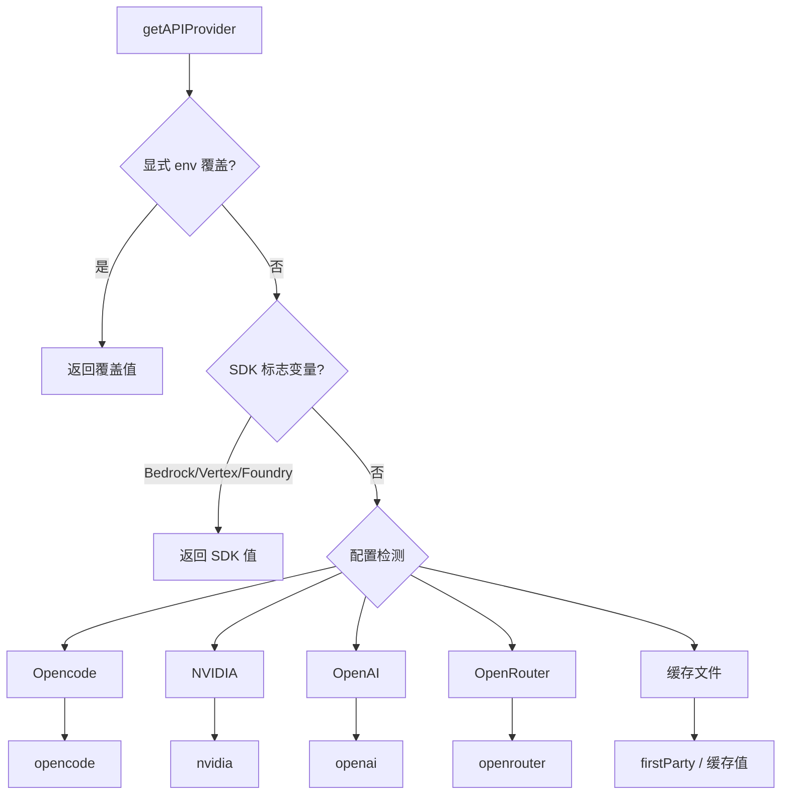
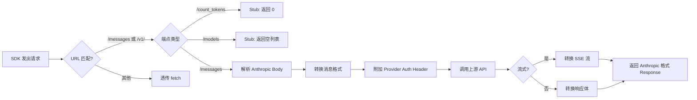
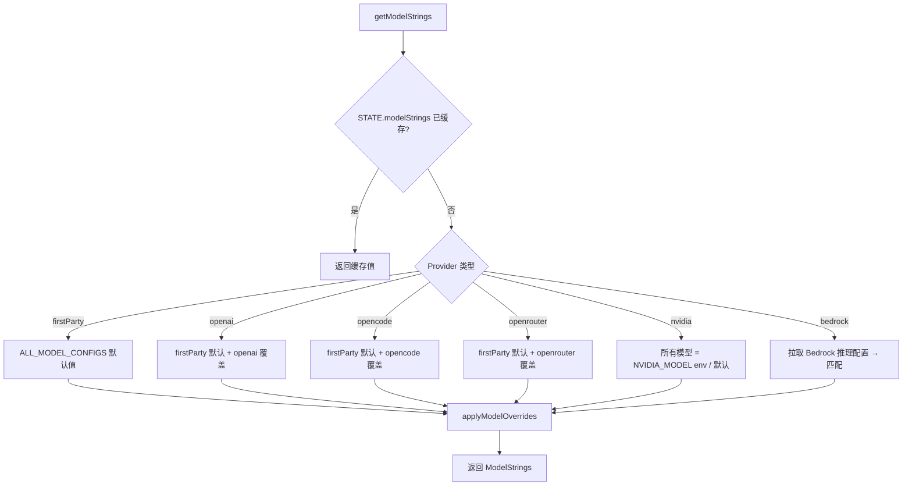

# 多 Provider 认证与协议转换架构

> 本文档描述 VersperClaw (cc-haha) 的多 Provider 认证架构、OAuth 2.0 流程、API 协议转换机制以及 Provider 配置管理体系。
> 代码库：`/home/yuki/Code/Agent/VersperClaw`

---

## 1. 支持的认证提供者

VersperClaw 支持以下 Provider，按认证方式与协议类型分类：

| Provider | 认证方式 | 协议格式 | 实现位置 |
|---|---|---|---|
| **Anthropic (first-party)** | OAuth 2.0 + PKCE 或 API Key | Anthropic Messages | `src/services/oauth/`, `src/services/api/client.ts` |
| **Anthropic Bedrock** | AWS STS / IAM 凭证 | Anthropic Messages (SDK) | `src/services/api/client.ts` (条件导入) |
| **Anthropic Vertex AI** | GCP google-auth-library | Anthropic Messages (SDK) | `src/services/api/client.ts` (条件导入) |
| **Anthropic Foundry (Azure)** | API Key 或 Azure AD | Anthropic Messages (SDK) | `src/services/api/client.ts` (条件导入) |
| **OpenAI / Codex** | API Key 或 Codex OAuth | `openai_chat` 或 `openai_responses` | `src/server/services/openaiOfficialProvider.ts` |
| **OpenRouter** | API Key | `openai_responses` (Proxy) | `src/utils/model/providers.ts` |
| **OpenCode Zen** | API Key 或免费 (public) | `openai_chat` (Fetch Override) | `src/services/api/opencodeClient.ts` |
| **NVIDIA NIM** | API Key (build.nvidia.com) | `openai_chat` (Fetch Override) | `src/services/api/nvidiaClient.ts` |
| **Local (Ollama/LM Studio/vLLM)** | 无 (Dummy Key) | `anthropic` 或 `openai_chat` | `src/server/config/providerPresets.json` |
| **DeepSeek, Zhipu GLM, Kimi, MiniMax, 接口AI, 胜算云** | API Key (auth_token) | `anthropic` (Native) | `src/server/config/providerPresets.json` |

---

## 2. 认证架构模式

### 2.1 两级架构总览

VersperClaw 拥有两套独立的 Provider 系统，设计目标不同：

```
Tier 1: TUI 内置 Provider (原始 Claude Code)
  用途: 终端 /login 快速切换
  存储: ~/.claude.json (单字段 authProvider)
  实现: src/services/api/client.ts + src/utils/model/providers.ts

Tier 2: cc-haha Provider 预设系统 (VersperClaw 扩展)
  用途: 桌面端多 Provider 管理、预设配置、Proxy 转换
  存储: ~/.claude/cc-haha/providers.json (结构化索引)
  实现: src/server/services/providerService.ts
         src/server/config/providerPresets.ts + .json
```

两个层级通过 `ProviderService.autoImportTuiProvider()` 自动同步：当桌面端检测到 TUI 已配置 Provider 但自身尚无活跃 Provider 时，自动导入 TUI 的 Provider 配置。

### 2.2 API Provider 类型定义

Provider 类型定义在 `src/utils/model/providers.ts`：

```typescript
export type APIProvider =
  | 'firstParty'
  | 'openrouter'
  | 'openai'
  | 'local'
  | 'opencode'
  | 'nvidia'
  | 'bedrock'
  | 'vertex'
  | 'foundry'
```

Provider 检测优先级：
1. **显式环境变量覆盖** (`CLAUDE_CODE_API_PROVIDER` 或 `BETTER_CLAWD_API_PROVIDER`)
2. **SDK 标志变量** (`CLAUDE_CODE_USE_BEDROCK`, `CLAUDE_CODE_USE_VERTEX`, `CLAUDE_CODE_USE_FOUNDRY`)
3. **配置检测** (`isOpencodeConfigured()`, `isNvidiaConfigured()`, `isOpenAIConfigured()`, `isOpenRouterConfigured()`)
4. **文件缓存** (`~/.claude.json` 中的 `authProvider` 字段)



### 2.3 Anthropic OAuth 2.0 with PKCE

Anthropic first-party 认证使用标准的 OAuth 2.0 Authorization Code Flow + PKCE，完整流程：

```
┌─────────┐     ┌──────────────┐     ┌───────────────┐     ┌────────────┐
│  CLI    │     │ localhost    │     │ Anthropic     │     │ Browser   │
│         │     │ OAuth Server │     │ OAuth Provider│     │ (User)    │
└────┬────┘     └──────┬───────┘     └───────┬───────┘     └─────┬──────┘
     │ 1. start()      │                      │                  │
     │────────────────>│                      │                  │
     │ 2. port          │                      │                  │
     │<────────────────│                      │                  │
     │                 │                      │                  │
     │ 3. generateCodeVerifier(), challenge() │                  │
     │ 4. buildAuthUrl()                      │                  │
     │                 │                      │                  │
     │ 5. openBrowser(automaticUrl)           │                  │
     │───────────────────────────────────────────────────────────>
     │                 │                      │                  │
     │                 │  6. HTTP GET /callback?code=...&state=  │
     │                 │<─────────────────────────────────────── │
     │                 │                      │                  │
     │ 7. validate state, extract code        │                  │
     │ 8. exchangeCodeForTokens(code)         │                  │
     │───────────────────────────────────────>│                  │
     │                 │    9. access_token + refresh_token     │
     │<───────────────────────────────────────│                  │
     │                 │                      │                  │
     │10. store tokens, set API key to null   │                  │
     │11. fetchProfileInfo() - 获取订阅类型    │                  │
```

**核心文件：**

| 职责 | 文件 |
|---|---|
| OAuth 服务入口 | `src/services/oauth/index.ts` - `OAuthService` 类 |
| PKCE 加密工具 | `src/services/oauth/crypto.ts` - SHA-256 code challenge |
| 授权码监听 | `src/services/oauth/auth-code-listener.ts` - 本地 HTTP 服务器 |
| Token 交换与刷新 | `src/services/oauth/client.ts` - axios POST 到 token endpoint |
| Profile 获取 | `src/services/oauth/getOauthProfile.ts` |
| OAuth 类型定义 | `src/services/oauth/types.ts` |
| OAuth 端点配置 | `src/constants/oauth.ts` - prod/staging/local 三级 |

**OAuth 端点配置** (`src/constants/oauth.ts`) 支持三层环境：

- **Production**: `api.anthropic.com`, `platform.claude.com`
- **Staging**: `api-staging.anthropic.com`, `platform.staging.ant.dev` (仅 ant 内部)
- **Local**: 可配置的 localhost 端口 (用于本地开发)
- **Custom (FedStart)**: 受限的白名单 Base URL 覆盖

---

## 3. Protocol Translation (Fetch Override 模式)

### 3.1 核心问题

Claude Code 使用的 `@anthropic-ai/sdk` 只认识 Anthropic Messages API 格式。对于使用 OpenAI 协议的非 Anthropic Provider，必须进行协议转换。

```
Anthropic Messages API  ←→  OpenAI Chat Completions / Responses API
──────────────────────       ─────────────────────────────────────
POST /v1/messages            POST /v1/chat/completions
POST /v1/messages?stream     POST /v1/chat/completions?stream=true
GET /v1/models               GET /v1/models
POST /v1/count_tokens        (无对应端点，需要 Stub)
```

### 3.2 Fetch Override 机制

每个非 Anthropic Provider 实现一个 `createXxxFetchOverride()` 函数，通过 Anthropic SDK 的 `ClientOptions['fetch']` 钩子注入：

```typescript
export function createNvidiaFetchOverride(): 
  (input: RequestInfo | URL, init?: RequestInit) => Promise<Response>
```

该重写在 `getAnthropicClient()` 中按 Provider 选择性注入：

```typescript
// src/services/api/client.ts 第 150-163 行
const provider = getAPIProvider()
if (provider === 'opencode') {
  opencodeFetchOverride = createOpenCodeFetchOverride(resolvedModel)
}
if (provider === 'nvidia') {
  nvidiaFetchOverride = createNvidiaFetchOverride()
}
const resolvedFetch = buildFetch(fetchOverride || opencodeFetchOverride || nvidiaFetchOverride, source)
```

### 3.3 Fetch Override 通用模式

所有 Fetch Override 实现共享相同的拦截模式：



### 3.4 消息格式转换

核心转换函数族位于 `src/services/api/copilotClient.ts`：

```
Anthropic → OpenAI:
  convertAnthropicMessagesToOpenAI(messages, systemPrompt)
  - system → role: 'system' 消息
  - image block → image_url (data: URI)
  - tool_result → role: 'tool' 消息
  - tool_use → tool_calls 数组
  - thinking → reasoning_content (提供商扩展)

  convertAnthropicToolsToOpenAI(tools)
  - { name, description, input_schema } → { type: 'function', function: { ... } }

OpenAI → Anthropic (流式):
  convertOpenAIStreamToAnthropic(openaiStream, model)
  - SSE data: {"choices":[{ "delta":{ "content":"..." } }]}
    → event: content_block_delta\ndata: {"delta":{"type":"text_delta","text":"..."}}

OpenAI → Anthropic (非流式):
  - choices[0].message.content → content: [{ type: 'text', text: ... }]
  - tool_calls → tool_use content blocks
  - finish_reason 'stop' → 'end_turn'
  - finish_reason 'tool_calls' → 'tool_use'
```

**Streaming SSE 事件对照表：**

| Anthropic (输出) | OpenAI (输入) |
|---|---|
| `message_start` | 合成，包含 message ID |
| `content_block_start` | 首次 `delta.content` 或 `delta.tool_calls.id` |
| `content_block_delta` text_delta | `delta.content` |
| `content_block_delta` thinking_delta | `delta.reasoning_content` |
| `content_block_start` tool_use | `delta.tool_calls[].id` |
| `content_block_delta` tool_use_delta | `delta.tool_calls[].function.arguments` |
| `content_block_stop` | delta 结束 / tool_call 完成 |
| `message_delta` | `choices[0].finish_reason` |
| `message_stop` | `[DONE]` |

### 3.5 服务端 Proxy 模式

除了客户端的 Fetch Override 模式，VersperClaw 还实现了一套**服务端 Proxy**，位于 `src/server/proxy/handler.ts`。

设计目标：将协议转换逻辑从客户端分离到独立 HTTP 服务，支持更灵活的 Provider 管理。

```
CLI/SDK                                    Proxy Server                             Upstream
   │                                           │                                       │
   │  POST /proxy/v1/messages                  │                                       │
   │  (Anthropic 格式请求)                     │                                       │
   │ ───────────────────────────────────────>  │                                       │
   │                                           │  获取 Provider 配置                    │
   │                                           │  读取 baseUrl, apiKey, apiFormat      │
   │                                           │                                       │
   │                                           │  anthropicToOpenaiChat(body)          │
   │                                           │  ─ 或 ─                              │
   │                                           │  anthropicToOpenaiResponses(body)     │
   │                                           │                                       │
   │                                           │  POST /v1/chat/completions            │
   │                                           │  或 POST /v1/responses                │
   │                                           │ ──────────────────────────────────>  │
   │                                           │                                       │
   │                                           │  openaiChatToAnthropic(res)           │
   │                                           │  或 openaiResponsesToAnthropic(res)   │
   │                                           │  (流式: XxxStreamToAnthropic)         │
   │                                           │                                       │
   │  ← Anthropic 格式响应                     │                                       │
   │ <───────────────────────────────────────  │                                       │
```

**服务端 Proxy 转换文件结构：**

```
src/server/proxy/
├── handler.ts                         # 主入口: POST 分发 + 错误处理
├── transform/
│   ├── types.ts                       # Anthropic & OpenAI 类型定义
│   ├── anthropicToOpenaiChat.ts       # 请求转换: Messages → Chat Completions
│   ├── anthropicToOpenaiResponses.ts  # 请求转换: Messages → Responses API
│   ├── openaiChatToAnthropic.ts       # 响应转换: Chat Completions → Messages
│   ├── openaiResponsesToAnthropic.ts  # 响应转换: Responses API → Messages
│   └── toolArguments.ts               # Tool 参数格式修正工具
└── streaming/
    ├── openaiChatStreamToAnthropic.ts         # 流式转换: Chat Completions SSE
    ├── openaiResponsesStreamToAnthropic.ts    # 流式转换: Responses API SSE
    └── openaiResponsesStreamToAnthropicResponse.ts
```

### 3.6 DeepSeek 推理兼容性

Proxy 还处理 DeepSeek 的特殊格式：

```typescript
function shouldUseDeepSeekReasoningCompat(baseUrl: string): boolean {
  return /(^|[./-])deepseek([./-]|$)/i.test(baseUrl) ||
         /(^|[./-])opencode\.ai([:/]|$)/i.test(baseUrl)
}
```

启用后，**thinking blocks** 会通过 `reasoning_content` 字段回传，并且 Anthropic 的 `thinking.type` 会被转换为 DeepSeek 兼容格式。

---

## 4. 各 Provider 集成详解

### 4.1 NVIDIA NIM

**文件**: `src/services/api/nvidiaClient.ts`

- **认证**: `getNvidiaApiKey()` → 写入 `Authorization: Bearer <key>` 请求头
- **特殊头**: `HTTP-Referer: https://claude.ai/`, `X-BILLING-INVOKE-ORIGIN: Better-Clawd`
- **端点**: `{baseUrl}/v1/chat/completions` (默认 `https://integrate.api.nvidia.com/v1`)
- **Model 列表**: 从 `/v1/models` 动态拉取，缓存于 `cachedNvidiaModels` 模块变量
- **默认 Model**: `nvidia/llama-3.1-nemotron-70b-instruct` (可通过 `NVIDIA_MODEL` 环境变量覆盖)
- **网络架构**: 通过 Sidecar 代理转发（`/api/proxy/nvidia`），适用于需要特殊头或 CORS 处理的 Provider。与之对比，OpenCode/OpenRouter 使用直接 Fetch Override 模式。

### 4.2 OpenCode Zen

**文件**: `src/services/api/opencodeClient.ts`

- **认证**: 支持 API Key 和匿名免费使用
- **免费模式**: 当 `apiKey` 为 `undefined` 或 `'public'` 时，注入 billing 特征码 (`x-anthropic-billing-header: cc_version=2.1.0-dev...`)，标记请求来源用于服务端路由
- **端点**: `https://opencode.ai/zen/v1/chat/completions`
- **Model 发现**: 
  - 从 `https://models.dev/api.json` 动态获取模型元数据（云端成本策略）
  - 从 `https://api.github.com/repos/anomalyco/opencode/releases/latest` 获取版本信息
  - 缓存于 `cachedModels` 模块变量
  - 支持免费模型列表过滤（life-free models）
- **动态 UA**: 根据版本和运行时自动构建 `User-Agent`
- **推理内容**: 支持 `reasoning_content` 到 `thinking` block 的转换
- **网络架构**: 直连模式（Direct Fetch Override），无需 Sidecar 代理

### 4.3 OpenAI / Codex Official

**文件**: `src/server/services/openaiOfficialProvider.ts`

- **认证**: Codex OAuth (通过 `hahaOpenAIOAuthService`)
- **协议**: `openai_responses` (Responses API)
- **运行时种类**: `openai_oauth` (需要 Token 刷新)
- **Base URL**: `/backend-api/codex` (从 `OPENAI_CODEX_API_ENDPOINT` 派生)
- **Model 列表**: 来自 `src/services/openaiAuth/models.ts` 的 `OPENAI_CODEX_MODEL_CATALOG`

### 4.4 自定义 OpenAI 兼容 Provider

**文件**: `src/services/api/customOpenAIClient.ts`

- **认证**: `ConnectedProviderInfo.apiKey` → `Bearer <key>`
- **协议**: `openai_chat` (Chat Completions)
- **Model**: 使用 `custom-openai:<modelId>` 前缀选择
- **Model 拉取**: `fetchOpenAICompatibleModelIds()` 从 `/v1/models` 获取
- **适用场景**: vLLM, Together AI, Groq 等任何 OpenAI 兼容端点

### 4.5 GitHub Copilot

**文件**: `src/services/api/copilotClient.ts` (原 copilotClient，现已演化为通用转换库)

- **认证**: OAuth Token (通过 `connectedProviders['github-copilot']`)
- **协议**: `openai_chat`
- **端点**: `https://api.githubcopilot.com/chat/completions`
- **特殊头**: `Openai-Intent: conversation-edits`, `x-initiator: user`
- **Model 发现**: 双源策略 — 优先从 Copilot API 获取，fallback 到 `models.dev/api.json`
- **兼容性缓存**: `copilotCompatibilityCache` 持久化模型兼容性信息到 `~/.claude.json`
- **Token 参数自动修复**: 当 API 返回 `"Use 'max_completion_tokens' instead"` 时自动切换参数

---

## 5. Provider 预设系统 (cc-haha)

### 5.1 预设配置

Provider 预设定义在 `src/server/config/providerPresets.json`，每个预设包含：

```json
{
  "id": "deepseek",
  "name": "DeepSeek",
  "baseUrl": "https://api.deepseek.com/anthropic",
  "apiFormat": "anthropic",
  "defaultModels": {
    "main": "deepseek-v4-pro",
    "haiku": "deepseek-v4-flash",
    "sonnet": "deepseek-v4-pro",
    "opus": "deepseek-v4-pro"
  },
  "needsApiKey": true,
  "authStrategy": "auth_token",
  "defaultEnv": {
    "ANTHROPIC_DEFAULT_HAIKU_MODEL_SUPPORTED_CAPABILITIES": "thinking,effort,..."
  },
  "modelContextWindows": {
    "deepseek-v4-pro": 1000000
  }
}
```

**预设支持的 Provider (截至当前):**

| Preset | API Format | Auth Strategy |
|---|---|---|
| official | anthropic | — |
| deepseek | anthropic | auth_token |
| zhipuglm | anthropic | auth_token |
| kimi | anthropic | auth_token |
| minimax | anthropic | auth_token |
| jiekouai | anthropic | auth_token |
| shengsuanyun | anthropic | auth_token |
| lmstudio | anthropic | auth_token_empty_api_key |
| ollama | anthropic | auth_token_empty_api_key |
| nvidia | openai_chat | api_key |
| custom | anthropic | auth_token |

### 5.2 认证策略 (`ProviderAuthStrategy`)

```typescript
type ProviderAuthStrategy = 
  | 'api_key'               // x-api-key: <key>     (NVIDIA)
  | 'auth_token'            // Authorization: Bearer <key>  (DeepSeek, Zhipu, Kimi...)
  | 'auth_token_empty_api_key' // Bearer + dummy x-api-key  (LM Studio, Ollama)
  | 'dual_same_token'      // x-api-key + Bearer 同一值
  | 'dual_dummy'           // x-api-key: dummy + Bearer: dummy  (OpenAI OAuth)
```

### 5.3 API Format

```typescript
type ApiFormat = 
  | 'anthropic'          // 原生 Anthropic Messages API (直连，无需 Proxy)
  | 'openai_chat'        // OpenAI Chat Completions /v1/chat/completions
  | 'openai_responses'   // OpenAI Responses API /v1/responses
```

### 5.4 存储结构

cc-haha 的 Provider 数据存储在：

```
~/.claude/cc-haha/
├── providers.json    # Provider 索引 (活跃 ID + Provider 列表)
└── settings.json     # 同步到 SDK 的环境变量
```

迁移历史通过 `persistentStorageMigrations.ts` 管理，使用 `CURRENT_PROVIDER_INDEX_SCHEMA_VERSION` 追踪 schema 版本。

---

## 6. Model 管理与切换

### 6.1 Model 解析链

```
src/utils/model/
├── providers.ts      → getAPIProvider() - 确定当前 Provider
├── modelStrings.ts   → getModelStrings() - 解析 Provider 对应的 Model ID
├── model.ts          → getMainLoopModel() - 最终选择的 Model
└── configs.ts        → ALL_MODEL_CONFIGS - 每个 Model 在各 Provider 的映射
```

**Model 字符串解析流程：**



### 6.2 Provider 切换时的缓存清除

**重要**：切换 Provider 后必须调用 `clearModelStrings()`，否则旧的 Model ID 会持续生效：

```typescript
// src/utils/model/modelStrings.ts
export function clearModelStrings(): void {
  setModelStringsState(null as unknown as ModelStrings)
}
```

### 6.3 Model Context Windows

两种方式配置模型上下文窗口：

1. **Preset 预设** (`providerPresets.json` 中的 `modelContextWindows` 字段)
2. **用户覆盖** (`~/.claude/cc-haha/providers.json` 中的 `modelContextWindows` 字段)

---

## 7. Provider 运行时环境

### 7.1 运行环境构建

`ProviderService.syncToSettings()` 将活跃 Provider 的配置写入 `~/.claude/cc-haha/settings.json`：

```
ANTHROPIC_BASE_URL=http://localhost:port/proxy/providers/<id>
ANTHROPIC_AUTH_TOKEN=dummy            # 用于 Anthropic SDK 认证
ANTHROPIC_API_KEY=dummy               # 同上
API_TIMEOUT_MS=300000
ANTHROPIC_MODEL=<model-id>
ANTHROPIC_DEFAULT_HAIKU_MODEL=...
ANTHROPIC_DEFAULT_SONNET_MODEL=...
ANTHROPIC_DEFAULT_OPUS_MODEL=...
MODEL_CONTEXT_WINDOWS={"model-id": 1000000}
```

### 7.2 OpenAI OAuth 运行时

对于 OpenAI Official Provider，特殊的环境变量：

```
CC_HAHA_OPENAI_OAUTH_PROVIDER=1
OPENAI_CODEX_OAUTH_FILE=<path-to-oauth-file>
```

---

## 8. 架构图汇总

```mermaid
graph TB
    subgraph "Tier 1: TUI 内置 Provider"
        A1[~/.claude.json]
        A2[src/utils/model/providers.ts]
        A3[src/services/api/client.ts]
        A4[src/services/api/nvidiaClient.ts]
        A5[src/services/api/opencodeClient.ts]
        A2 -->|getAPIProvider| A3
        A3 -->|createNvidiaFetchOverride| A4
        A3 -->|createOpenCodeFetchOverride| A5
    end

    subgraph "Tier 2: cc-haha Provider 系统"
        B1[~/.claude/cc-haha/providers.json]
        B2[~/.claude/cc-haha/settings.json]
        B3[src/server/services/providerService.ts]
        B4[src/server/config/providerPresets.json]
        B5[src/server/proxy/handler.ts]
        B3 -->|读写| B1
        B3 -->|syncToSettings| B2
        B3 -->|activateProvider| B4
        B3 -->|getProviderForProxy| B5
    end

    subgraph "Anthropic SDK"
        C1[@anthropic-ai/sdk]
        C2[AnthropicBedrock]
        C3[AnthropicVertex]
        C4[AnthropicFoundry]
    end

    subgraph "协议转换层"
        D1[anthropicToOpenaiChat]
        D2[anthropicToOpenaiResponses]
        D3[openaiChatToAnthropic]
        D4[openaiResponsesToAnthropic]
        D5[openaiChatStreamToAnthropic]
        D6[openaiResponsesStreamToAnthropic]
        D7[copilotClient.ts - 通用转换]
    end

    subgraph "OAuth 2.0 流程"
        E1[src/services/oauth/index.ts]
        E2[src/services/oauth/client.ts]
        E3[src/services/oauth/crypto.ts]
        E4[src/services/oauth/auth-code-listener.ts]
        E5[src/constants/oauth.ts]
    end

    A3 -->|第一方| C1
    A3 -->|Bedrock| C2
    A3 -->|Vertex| C3
    A3 -->|Foundry| C4
    A3 -->|Fetch Override| D7
    
    B5 --> D1
    B5 --> D2
    B5 --> D3
    B5 --> D4
    B5 --> D5
    B5 --> D6

    C1 --> E1
```

---

## 9. 添加新 Provider 的标准流程

当需要支持一个新的 OpenAI 兼容 Provider 时，按以下步骤操作：

1. **Provider 类型**: 在 `src/utils/model/providers.ts` 的 `APIProvider` 联合类型中添加
2. **检测函数**: 实现 `isXxxConfigured()` 并在 `getAPIProvider()` 调用链中加入
3. **Model 字符串**: 在 `src/utils/model/modelStrings.ts` 的 `getBuiltinModelStrings()` 中添加映射
4. **Fetch Override**: 如果协议需要转换，实现 `createXxxFetchOverride()` (参考 `nvidiaClient.ts`)
5. **客户端集成**: 在 `src/services/api/client.ts` 的 `getAnthropicClient()` 中注入 Override
6. **预设配置**: 在 `src/server/config/providerPresets.json` 中添加预设项
7. **环境变量**: 在 `providerRuntimeEnv.ts` 的 `getManagedEnvKeys()` 中添加变量清理
8. **认证策略**: 如果使用非标准认证，在 `buildAnthropicAuthHeaders()` 中添加策略

---

## 10. 关键陷阱与注意事项

### 10.1 Model Strings 缓存

**问题**: `getModelStrings()` 缓存 Provider 特定的 Model ID 到 `STATE.modelStrings` 中。切换 Provider 后，如果不调用 `clearModelStrings()`，旧的 Model ID 会持续生效，导致模型解析错误。

**解决**: 所有 Provider 切换路径 (`/login`, Provider 激活) 都必须调用 `clearModelStrings()`。

### 10.2 DeepSeek 的 max_tokens 限制

Claude Code 默认发送非常大的 `max_tokens` (如 128K)，但 DeepSeek 限制为 8192。服务端 Proxy 的 `anthropicToOpenaiChat()` 已省略 `max_tokens` 透传，让上游使用自己的默认值。

### 10.3 OAuth Token 刷新竞态

`refreshOAuthToken()` 中有一个关键优化：当全局配置和 Secure Storage 中都有 profile 数据时，跳过 `/api/oauth/profile` 的额外网络请求。但在 `installOAuthTokens` → `performLogout` 的 re-login 路径中，需要穿透缓存以确保订阅类型正确。

### 10.4 Streaming SSE 转义

`convertOpenAIStreamToAnthropic()` 中使用 `JSON.stringify(reasoning_content).slice(1, -1)` 来转义内容中的特殊字符。如果 reasoning_content 包含换行符或 Unicode 字符，直接拼接字符串会导致 SSE 格式损坏。

### 10.5 Copilot 的 max_tokens → max_completion_tokens 自动修复

Copilot API 对部分模型使用 `max_completion_tokens` 而非 `max_tokens`。`sendCopilotChatCompletion()` 在收到特定错误信息时会自动切换参数并重试，并将兼容性信息缓存 24 小时。

---

## 11. 参考资料

- **cc-switch** (原始 Proxy 参考实现): https://github.com/farion1231/cc-switch
- **Anthropic Messages API**: https://docs.anthropic.com/en/api/messages
- **OpenAI Chat Completions API**: https://platform.openai.com/docs/api-reference/chat
- **OpenAI Responses API**: https://platform.openai.com/docs/api-reference/responses
- **OAuth 2.0 with PKCE**: https://oauth.net/2/pkce/
- **NVIDIA NIM**: https://build.nvidia.com/docs
- **OpenCode Zen**: https://opencode.ai
